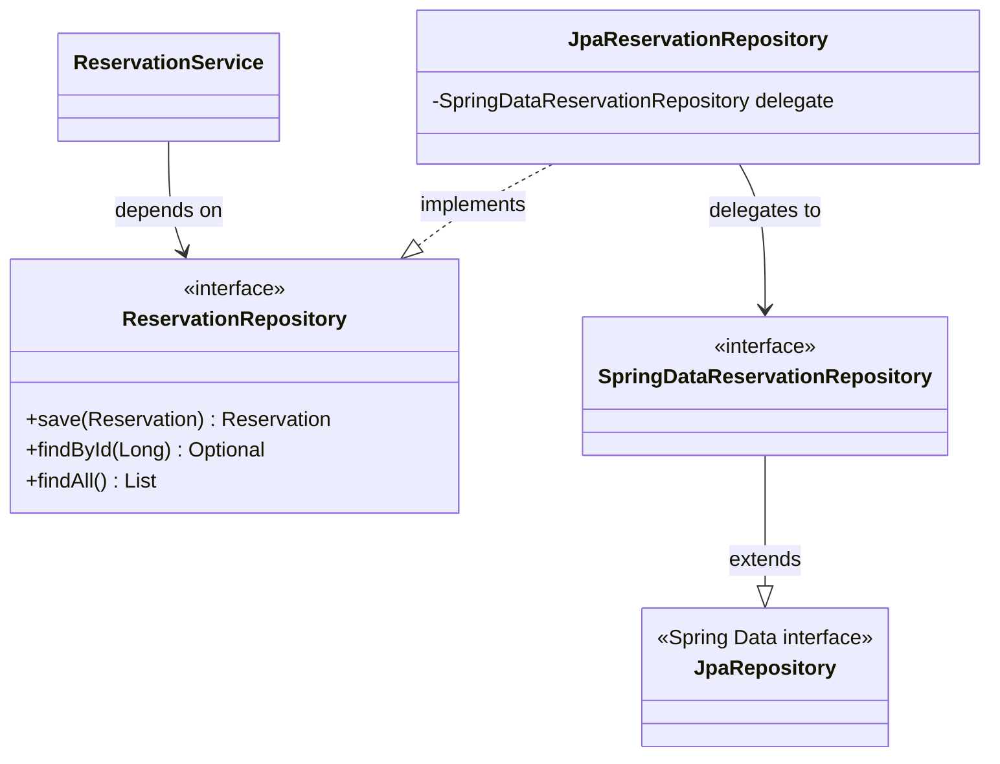
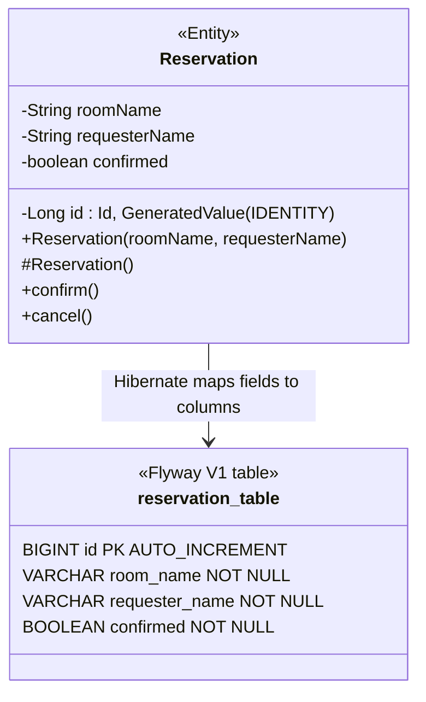
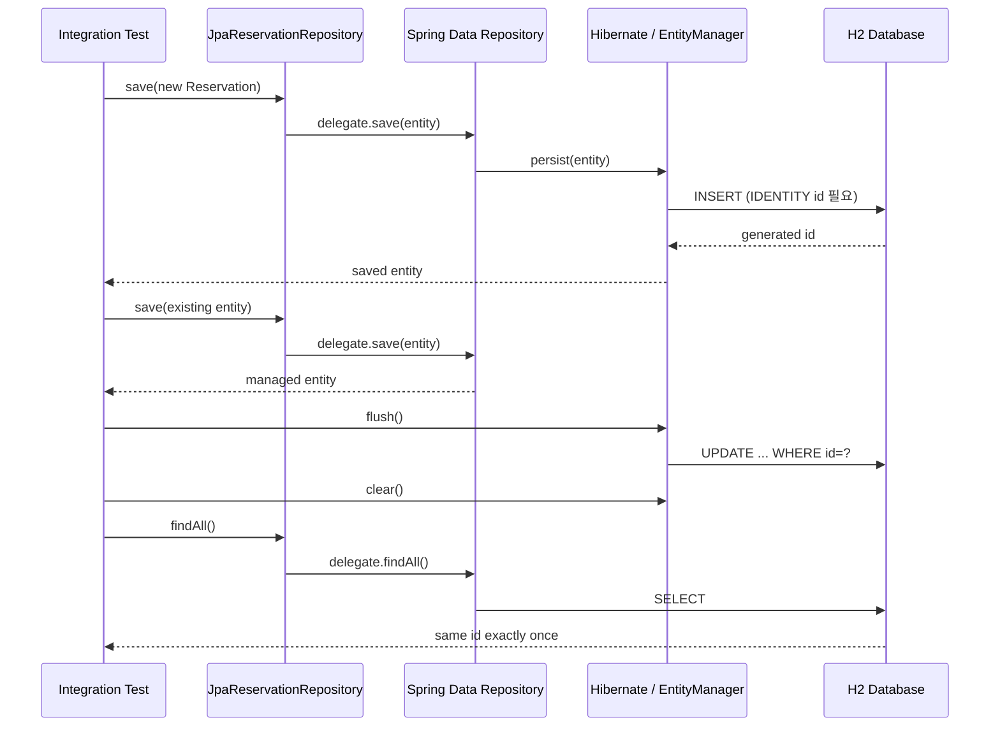

# 코드 패턴 노트 — "그래서 어떻게 쓰지?"

> ## ⚠️ 이 파일의 사용법
>
> **이건 찾아보는 참조서다. 처음부터 읽는 책이 아니다.**
>
> 순서대로 읽으면 "읽을 땐 알겠는데 못 쓰겠다"가 그대로 남는다. 본인이 쓴 글이라 술술 읽히고, 그 매끄러움을 "알고 있음"으로 착각하기 때문이다(유창성 착각).
>
> **올바른 순서:**
> `PATTERN_DRILLS.md`로 **먼저 손으로 쓴다** → 막히거나 틀린다 → **그때 여기서 찾는다**
>
> 못 떠올려 낑낑댄 시간이 기억을 만든다. 그 상태에서 정답을 봐야 박힌다.

`vocab.md`가 **용어의 뜻**(선언적 지식)이라면, 이 파일은 **코드의 형태**(절차적 지식)다. 둘은 다른 능력이라 하나로 다른 하나가 채워지지 않는다.

---

## 0. 계층 흐름 한 장

요청 하나가 지나는 길. **각 층에 붙는 애노테이션이 그 층의 정체성**이다.

```
  HTTP 요청 (JSON)
        │
        ▼
┌───────────────────────────────────────────────┐
│ @RestController   ReservationController       │  HTTP만 안다
│   @PostMapping / @RequestBody @Valid          │  DTO ↔ 문자열 변환
│   @PathVariable @Positive                     │  비즈니스 로직 없음
└───────────────┬───────────────────────────────┘
                │ 생성자 주입
                ▼
┌───────────────────────────────────────────────┐
│ @Service          ReservationService          │  로직·규칙
│   Optional → 도메인 예외로 변환               │  HTTP를 모른다
│   무상태(요청별 값은 지역변수)                │  DB를 모른다
└───────────────┬───────────────────────────────┘
                │ 생성자 주입 (인터페이스에 의존 = DIP)
                ▼
┌───────────────────────────────────────────────┐
│ interface  ReservationRepository   ← What     │  저장만 안다
│ @Repository  ...RepositoryImpl     ← How      │  로직 없음
└───────────────────────────────────────────────┘

  예외가 터지면 어느 층에서든:
        │
        ▼
┌───────────────────────────────────────────────┐
│ @RestControllerAdvice  GlobalExceptionHandler │  예외 → HTTP 상태코드
└───────────────────────────────────────────────┘
```

**층을 가르는 기준 한 줄:** 위층은 아래층을 알지만, **아래층은 위층을 절대 모른다.** Service에 `ResponseEntity`가 등장하면 그건 층이 무너진 것이다.

---

# Week A — 웹 계층

## P1. 엔드포인트 하나 받기 — Controller

**[언제]** 새 URL을 열 때.

**[골격]**

```java
@RestController                                    // ① Bean 등록 + 반환값을 JSON/문자열 본문으로
public class ReservationController {

    private final ReservationService reservationService;   // ② final — 조립 후 안 바뀐다

    public ReservationController(ReservationService reservationService) {  // ③ 생성자 주입
        this.reservationService = reservationService;
    }

    @PostMapping("/reservations")                                  // ④ 메서드 + 경로
    public String reserve(@RequestBody @Valid ReservationRequest request) {
        Reservation reservation = reservationService.reserve(       // ⑤ 즉시 위임
                request.roomName(), request.requesterName());
        return "예약 번호" + reservation.getId() + " ...";
    }

    @PostMapping("/reservations/cancel/{id}")                      // ⑥ {id} ↔ @PathVariable 짝
    public String cancel(@PathVariable @Positive(message = "예약 번호는 1 이상이어야 합니다") Long id) {
        Reservation reservation = reservationService.cancel(id);
        return reservation.getRequesterName() + "님이 ...";
    }
}
```

**[판단]**
- Controller에는 **HTTP 입출력만** 둔다. `if`로 업무 규칙을 판단하기 시작하면 그건 Service 일이다(SRP).
- `@RequestBody`는 **본문(JSON)** 을, `@PathVariable`은 **URL 경로 조각**을 받는다. 받는 위치가 다르다.
- `@Positive`가 `@PathVariable`에 직접 붙는다. Spring Boot 3.2+는 컨트롤러 파라미터 검증이 기본 내장이라 `@Validated`를 클래스에 안 붙여도 동작한다.

**[❌ 흔한 실수]**

| 실수 | 실제로 터진 것 |
|---|---|
| 같은 이름·같은 파라미터 메서드를 애노테이션만 다르게 2개 선언 | **컴파일 에러.** 컴파일러는 애노테이션을 안 본다. **이름 + 파라미터**만으로 중복을 판단한다 (D01) |
| `@PathVariable Long id`는 썼는데 경로에 `{id}`를 안 넣음 | **컴파일 통과, `./gradlew test`도 통과.** 실제 요청이 와서야 500: `Required URI template variable 'id' for method parameter type Long is not present` (D04) |
| 상태코드를 `201` 같은 **정수**로 반환 | 컴파일 에러. `HttpStatus.CREATED`를 쓴다 (D01) |

> **D04가 이 패턴의 핵심 교훈이다.** 애노테이션과 문자열의 짝은 **문자열끼리의 약속**이라 컴파일러 사정권 밖이다. 초록불이어도 안전하지 않다.

**[근거]** `controller/ReservationController.java:14-38`

---

## P2. 요청 DTO — `record` + 검증

**[언제]** 클라이언트가 보내는 JSON을 받을 때.

**[골격]**

```java
public record ReservationRequest(
        @NotBlank(message = "방 이름은 비어있을 수 없습니다")   String roomName,
        @NotBlank(message = "예약자 이름은 비어있을 수 없습니다.") String requesterName
) {}
```

호출은 이렇게:

```java
request.roomName()        // ✅ 필드 이름 그대로
request.getRoomName()     // ❌ record에는 이런 메서드가 없다
```

**[판단]**
- **DTO는 `record`, Domain은 `class`.** 로드맵 §7 규칙이기도 하다. DTO는 값을 옮기기만 하니 불변이면 되고, Domain은 상태가 바뀌어야 하니 불변이면 안 된다.
- 검증 애노테이션은 **DTO에 붙인다.** 잘못된 입력을 계층 초입에서 끊기 위해서다.
- 이것만으로는 검증이 안 돌아간다. **Controller 파라미터에 `@Valid`가 있어야** 실행된다. 둘은 한 쌍이다.

**[❌ 흔한 실수]**

| 실수 | 실제로 터진 것 |
|---|---|
| `request.getRoomName()` 호출 | `cannot find symbol`. record 접근자는 **필드명 그대로**이고 JavaBean `getXxx` 관례를 안 따른다 (D02) |
| 필드는 `roomname`, 호출은 `roomName()` | `cannot find symbol`. 자바는 대소문자를 구분한다 (D02) |
| DTO에 `@NotBlank`만 달고 Controller에 `@Valid`를 안 붙임 | 검증이 **조용히 안 돈다.** 빈 문자열이 그대로 통과 |

**[근거]** `dto/ReservationRequest.java:6` · `@Valid` 짝은 `controller/ReservationController.java:24`

---

## P3. Domain 클래스 — 가변 + 캡슐화

**[언제]** 업무 규칙을 가진 객체가 필요할 때.

**[골격]**

```java
public class Reservation {                 // record 아님 — 상태가 바뀌어야 하니까
    private final String roomName;         // 한 번 정하면 안 바뀌는 것 → final
    private final String requesterName;
    private boolean confirmed;             // 바뀌는 것 → final 아님
    private Long id;                       // 저장 전엔 null

    public Reservation(String roomName, String requesterName) {
        this.roomName = roomName;
        this.requesterName = requesterName;
        this.confirmed = false;            // 시작 상태를 생성자가 강제한다
    }

    public void confirm() { this.confirmed = true; }    // 상태 변경은 "이름 있는 행동"으로만
    public void cancel()  { this.confirmed = false; }

    public void assignId(Long id) { this.id = id; }     // setXxx가 아닌 이유: 저장소만 부르라고
}
```

**[판단]**
- **`setConfirmed(boolean)`을 만들지 않는다.** `confirm()` / `cancel()`처럼 **업무 의미가 담긴 이름**만 연다. 그래야 "언제 true가 되는가"를 이 클래스 하나만 읽고 알 수 있다.
- `confirmed`의 초기값을 생성자가 `false`로 못 박는다. 외부에서 확정 상태로 만들어진 예약이 태어날 수 없다.
- **`id`는 저장소가 붙인다.** 그래서 `final`이 아니고, 그래서 `assignId`라는 별도 문이 필요하다.

**[❌ 흔한 실수]**

| 실수 | 실제로 터진 것 |
|---|---|
| `cancel()` 처리에서 `findById` 없이 `new Reservation(...)` 으로 새 객체를 만들어 저장 | **새 예약이 하나 더 생기고** 원본은 `confirmed: true` 그대로 남았다. 값이 같아도 자바에겐 다른 인스턴스이고, 저장소도 구별할 **식별자가 없었다** (D04) |

> **이게 "식별자(PK)가 왜 필요한가"를 몸으로 배운 지점이다.** 갱신하려면 먼저 **찾아야** 하고, 찾으려면 **고유한 값**이 있어야 한다.

**[근거]** `domain/Reservation.java:8-48`

---

## P4. 도메인 예외

**[언제]** 업무적으로 의미 있는 실패를 표현할 때.

**[골격]**

```java
public class ReservationNotFoundException extends RuntimeException {
    public ReservationNotFoundException(Long id) {
        super("예약을 찾을 수 없습니다. (id: " + id + ")");   // 메시지 조립을 예외가 책임진다
    }
}
```

**[판단]**
- **`RuntimeException`을 상속**한다. checked 예외로 만들면 모든 호출부가 `throws`를 달아야 해서 계층이 오염된다.
- **메시지를 생성자 안에서 만든다.** 호출부는 `new ReservationNotFoundException(id)` 한 줄이면 되고, 메시지 형식이 한 곳에만 있다.
- 이름이 `NotFound`인 것과 응답이 404인 것은 **별개**다. 연결은 P5의 전역 처리기가 한다. **도메인은 HTTP를 몰라야 한다.**

**[근거]** `exception/ReservationNotFoundException.java:3-7`

---

## P5. 전역 예외 처리 — 핸들러 4종

**[언제]** 예외를 HTTP 응답으로 바꿀 때. **한 번 만들어두고 계속 추가**하는 파일이다.

**[골격]**

```java
@RestControllerAdvice                      // 전역 예외 후보로 수집된다
public class GlobalExceptionHandler {

    private static final Logger log = LoggerFactory.getLogger(GlobalExceptionHandler.class);

    // ① @Valid (본문 DTO) 실패 → 400 + 필드별 메시지
    @ExceptionHandler(MethodArgumentNotValidException.class)
    public ResponseEntity<Map<String, String>> handleValidation(MethodArgumentNotValidException ex) {
        Map<String, String> errors = new LinkedHashMap<>();
        ex.getBindingResult().getFieldErrors()
                .forEach(error -> errors.put(error.getField(), error.getDefaultMessage()));
        return ResponseEntity.status(HttpStatus.BAD_REQUEST).body(errors);
    }

    // ② 파라미터 검증(@PathVariable @Positive) 실패 → 400
    @ExceptionHandler(HandlerMethodValidationException.class)
    public ResponseEntity<Map<String, Object>> handleMethodValidation(HandlerMethodValidationException ex) {
        List<String> errors = ex.getAllErrors().stream().map(e -> e.getDefaultMessage()).toList();
        return ResponseEntity.status(HttpStatus.BAD_REQUEST).body(Map.of("errors", errors));
    }

    // ③ 도메인 예외 → 404
    @ExceptionHandler(ReservationNotFoundException.class)
    public ResponseEntity<Map<String, String>> handleNotFound(ReservationNotFoundException ex) {
        return ResponseEntity.status(HttpStatus.NOT_FOUND).body(Map.of("error", ex.getMessage()));
    }

    // ④ 최후의 그물 → 500. 원인은 로그로, 사용자에겐 일반 문구만
    @ExceptionHandler(Exception.class)
    public ResponseEntity<Map<String, String>> handleUnexpected(Exception ex) {
        log.error("처리하지 못한 예외", ex);                     // 스택트레이스 전부 (두 번째 인자로!)
        return ResponseEntity.status(HttpStatus.INTERNAL_SERVER_ERROR)
                .body(Map.of("error", "요청 처리 중 오류가 발생했습니다."));
    }
}
```

**[판단]**
- **검증 실패가 두 종류**라 핸들러도 둘이다. 본문 DTO(`@RequestBody @Valid`)는 `MethodArgumentNotValidException`, 파라미터(`@PathVariable @Positive`)는 `HandlerMethodValidationException`. **하나만 만들면 나머지 한 종류가 500으로 샌다.**
- ④에서 **`ex.getMessage()`를 응답에 넣지 않는다.** SQL문·파일 경로·라이브러리 버전이 그대로 새어 나간다. **원인은 안으로(로그), 사용자에겐 최소한만.**
- `log.error("...", ex)` — 예외를 **두 번째 인자**로 넘겨야 스택트레이스가 남는다. 문자열에 이어붙이면 메시지만 남고 추적이 사라진다.

**[❌ 흔한 실수]**

| 실수 | 실제로 터진 것 |
|---|---|
| 두 번째 `@ExceptionHandler` 메서드를 **클래스 닫는 `}` 뒤**에 작성 | 컴파일 에러. `}` 이후는 파일 최상위라 `class`/`interface`/`enum`/`record`만 올 수 있다 (D03) |
| `ResponseE ntity` — 타입 이름 중간에 공백 | `')' or ',' expected`. 공백이 토큰을 둘로 가른다 (D03) |
| `newLinkedHashMap<>()` — `new` 뒤 공백 누락 | 컴파일 에러 (D03) |
| 검증 실패 응답에 **모든 필드**가 나올 거라 예측 | `getFieldErrors()`는 **실패한 필드만** 담는다. 통과한 필드는 애초에 목록에 없다 (D03) |

**[근거]** `exception/GlobalExceptionHandler.java:17-49`

---

## P6. Repository — 인터페이스 + 저장 계약

**[언제]** 저장소가 필요할 때. **인터페이스와 구현을 반드시 분리**한다.

**[골격 — 인터페이스: What만]**

```java
public interface ReservationRepository {
    Reservation save(Reservation reservation);
    List<Reservation> findAll();
    Optional<Reservation> findById(Long id);       // 없을 수 있음을 반환형에 드러낸다
}
```

**[골격 — 구현: How]**

```java
public class InMemoryReservationRepository implements ReservationRepository {
    private final List<Reservation> store = new ArrayList<>();
    private long nextId = 1;

    @Override
    public Reservation save(Reservation reservation) {
        if (reservation.getId() == null) {              // ① 신규 → 추가
            reservation.assignId(nextId++);
            store.add(reservation);
            return reservation;
        }
        for (int i = 0; i < store.size(); i++) {        // ② 기존 → 교체
            if (store.get(i).getId().equals(reservation.getId())) {   // equals! (== 아님)
                store.set(i, reservation);
                return reservation;
            }
        }
        throw new IllegalArgumentException("저장소에 없는 예약 번호입니다: " + reservation.getId());
    }
}
```

**[판단]**
- **`save()`의 계약: ID 없으면 추가, 있으면 교체.** 이 분기가 저장소의 핵심이다. 빠뜨리면 취소할 때마다 행이 하나씩 늘어난다.
- **`Optional`로 부재를 표현**하고, 예외로 바꾸는 건 Service가 한다(P7). 저장소는 "없다"까지만 말한다.
- `Long`은 Wrapper라 **`.equals()`로 비교**한다. `==`는 참조 비교라 작은 값에선 캐싱 때문에 우연히 맞는 것처럼 보인다 — 더 나쁘다.
- **인터페이스를 분리하는 이유는 테스트다.** 실행은 DB 구현, 테스트는 메모리 구현. Week B에서 JDBC → JPA로 갈아탈 때 Service가 한 줄도 안 바뀐 게 이 설계의 값이다.

**[❌ 흔한 실수]**

| 실수 | 실제로 터진 것 |
|---|---|
| `for` 루프가 못 찾은 경우의 `return`을 안 씀 | `missing return statement`. 모든 실행 경로가 값을 돌려줘야 한다 (D04) |
| `if (r.getId() == id))` — 괄호 짝 안 맞음 | `illegal start of expression`. 파서가 그 지점부터 문법을 못 읽는다 (D04) |
| 인터페이스만 같으면 계약도 같을 거라 가정 | **인터페이스는 시그니처만 강제하고 의미는 강제 못 한다.** JDBC 구현은 이 분기가 없어 무조건 INSERT였고, 취소할 때마다 복사본이 생겼다 (D09) |

**[근거]** `repository/ReservationRepository.java:8-12` · `repository/InMemoryReservationRepository.java:12-50`

---

## P7. Service — 조율 + `Optional` → 도메인 예외

**[언제]** 업무 규칙이 필요할 때. **Controller와 Repository 사이는 항상 여기를 지난다.**

**[골격]**

```java
@Service
public class ReservationService {

    private final ReservationRepository reservationRepository;   // 구현체 아닌 인터페이스에 의존 (DIP)

    public ReservationService(ReservationRepository reservationRepository) {
        this.reservationRepository = reservationRepository;
    }

    public Reservation reserve(String roomName, String requesterName) {
        Reservation reservation = new Reservation(roomName, requesterName);
        reservation.confirm();                          // 규칙: 예약하면 확정
        return reservationRepository.save(reservation);
    }

    public Reservation cancel(Long id) {
        Reservation reservation = reservationRepository.findById(id)
                .orElseThrow(() -> new ReservationNotFoundException(id));   // 부재 → 도메인 예외
        reservation.cancel();                           // 상태 변경은 도메인에게 시킨다
        reservationRepository.save(reservation);
        return reservation;
    }
}
```

**[판단]**
- **찾기 → 바꾸기 → 저장**이 갱신의 3단계다. `new`로 시작하면 갱신이 아니라 추가가 된다(P3 참조).
- **`Optional`이 여기서 끝난다.** `orElseThrow`로 도메인 예외로 바꿔 위층에 넘기면, Controller는 예외를 몰라도 되고 전역 처리기가 404로 만든다.
- **상태 변경을 Service가 직접 하지 않는다.** `reservation.setConfirmed(false)`가 아니라 `reservation.cancel()`. 규칙은 도메인이 갖는다.
- **필드에 요청별 값을 두지 않는다.** Bean은 싱글톤 하나를 모든 스레드가 공유한다. 요청마다 달라지는 값은 **매개변수·지역변수**로.

**[❌ 흔한 실수]**

| 실수 | 실제로 터진 것 |
|---|---|
| Controller의 생성자를 복사해 붙이고 클래스명을 안 바꿈 | `return type required`. 이름이 다르면 생성자가 아니라 **반환형 없는 메서드**로 파싱된다 (D05) |
| 필드명·의존 타입을 안 맞춤 | `cannot find symbol`, `incompatible types` (D05) |
| 요청별 값을 싱글톤 Service의 필드에 저장 | 여러 스레드가 같은 객체를 공유하므로 요청끼리 값이 섞인다. 해결책은 `final`이 아니라 **애초에 필드에 안 두는 것** (D05·D09 오답) |

**[근거]** `service/ReservationService.java:8-29`

---

## P8. Bean 등록과 조립 (DI)

**[언제]** 항상. 위 패턴들이 **실제로 연결되는 방식**이다.

**[골격]**

```java
@RestController  class ReservationController { ... }     // 층마다 다른 이름, 하는 일은 같다:
@Service         class ReservationService    { ... }     //   "이 클래스를 Bean으로 등록해라"
@Repository      class JdbcReservationRepository { ... }
```

조립은 Spring이 한다:

```
Repository Bean 생성 → Service 생성자에 주입 → Controller 생성자에 주입
```

**[판단]**
- **애노테이션은 "Bean으로 등록"만 시킨다.** `@Service`와 `@Repository`는 기능 차이보다 **읽는 사람에게 층을 알려주는** 의미가 크다.
- **주입은 타입으로 이뤄진다.** `ReservationRepository` 타입 Bean을 찾아 넣는다. 그래서 **후보가 0개거나 2개면 기동이 실패**한다.
- **생성자 주입을 쓴다.** 필수 의존성이 타입으로 드러나고, `final`이 가능해 조립 후 안 바뀐다.

**[❌ 흔한 실수]**

| 실수 | 실제로 터진 것 |
|---|---|
| `@Repository`를 뗐다 | 컴파일은 **성공**, `contextLoads()` 실패 → `NoSuchBeanDefinitionException`. **사라진 건 자바의 구현 관계가 아니라 Bean 등록**이다 (D05) |
| `@Repository` 붙은 구현체가 2개 | `NoUniqueBeanDefinitionException: expected single matching bean but found 2`. 스프링은 임의로 고르지 않고 **즉시 죽는다** — 잘못 고른 채 도는 사고가 더 조용하기 때문 (D09) |

> **부수 관찰:** 컨텍스트가 못 뜨면 그 위의 **모든 테스트가 함께 죽는다.** 실패 6개가 떴다고 원인이 6개인 게 아니다.

**[근거]** `service/ReservationService.java:8` · `repository/JdbcReservationRepository.java:16` · `StudyRoomApiApplicationTests.java:21`

---

## P9. 테스트 3종 — 무엇을 어디까지 검증하나

**[언제]** 코드를 고정하고 싶을 때. **무엇을 쓸지는 "무엇을 지나게 하고 싶은가"로 정한다.**

| 종류 | 스프링 뜨나 | 지나는 구간 | 언제 |
|---|---|---|---|
| **순수 단위** | ❌ | 내 클래스 + 대역 | 로직·계약 |
| **핸들러 단위** | ❌ | 그 클래스 하나 | 변환 규칙 |
| **MockMvc** | ✅ | URL 매핑 → 검증 → 컨트롤러 → 예외 리졸버 → JSON | 층이 실제로 이어지는지 |
| **컨텍스트** | ✅ | Bean 조립 전체 | 기동·싱글톤 |

**[골격 ① 순수 단위 — `new`로 직접 조립]**

```java
class ReservationServiceTest {
    @Test
    void cancelUpdatesExistingReservationWithoutAddingDuplicate() {
        InMemoryReservationRepository repository = new InMemoryReservationRepository();  // 대역
        ReservationService service = new ReservationService(repository);
        Long id = service.reserve("A-101", "민지").getId();

        service.cancel(id);

        assertEquals(1, repository.findAll().size());          // 행이 안 늘었나
        assertFalse(repository.findById(id).orElseThrow().isConfirmed());
    }
}
```
> **생성자 주입의 값이 여기서 나온다.** 스프링 없이 `new`만으로 조립된다.

**[골격 ② 핸들러 단위]**

```java
class GlobalExceptionHandlerTest {
    private final GlobalExceptionHandler handler = new GlobalExceptionHandler();

    @Test
    void unexpectedExceptionDoesNotExposeInternalMessage() {
        String internalMessage = "jdbc:password=secret";
        ResponseEntity<Map<String, String>> response =
                handler.handleUnexpected(new RuntimeException(internalMessage));

        assertEquals(HttpStatus.INTERNAL_SERVER_ERROR, response.getStatusCode());
        assertFalse(response.getBody().toString().contains(internalMessage));  // 새어나가지 않았나
    }
}
```

**[골격 ③ MockMvc — 포트 없이 전 구간]**

```java
@SpringBootTest
@AutoConfigureMockMvc
class ReservationControllerHttpTest {

    @Autowired private MockMvc mockMvc;

    @Test
    void reserveReturns400ForBlankBodyFields() throws Exception {
        mockMvc.perform(post("/reservations")
                        .contentType(MediaType.APPLICATION_JSON)
                        .content("""
                                { "roomName": "", "requesterName": "" }
                                """))                                  // 텍스트 블록 — 이스케이프 지옥 회피
                .andExpect(status().isBadRequest())
                .andExpect(jsonPath("$.roomName").value("방 이름은 비어있을 수 없습니다"));
    }

    @Test
    void cancelReturns404WhenReservationDoesNotExist() throws Exception {
        mockMvc.perform(post("/reservations/cancel/{id}", 999_999L))
                .andExpect(status().isNotFound())
                .andExpect(jsonPath("$.error").value("예약을 찾을 수 없습니다. (id: 999999)"));
    }
}
```

**[판단]**
- **P1의 `@PathVariable` 버그는 MockMvc만 잡는다.** URL 매핑을 실제로 지나야 드러나기 때문이다. 단위 테스트를 아무리 늘려도 안 잡힌다.
- 한글 JSON은 **텍스트 블록(`"""`)** 으로 쓴다. curl/PowerShell로 보내면 인코딩과 따옴표 이스케이프에서 깨진다 (D02에서 실제로 겪음).
- **초록불은 "버그가 없다"가 아니라 "지금 확인한 것들에는 문제가 없다"이다.** 테스트 10개가 전부 통과하는 동안 JDBC 구현은 취소할 때마다 복사본을 만들고 있었다 (D09).

**[근거]** `ReservationServiceTest.java:11-30` · `GlobalExceptionHandlerTest.java:12-36` · `ReservationControllerHttpTest.java:15-64` · `StudyRoomApiApplicationTests.java:14-29`

---

## Week A 요약 — 엔드포인트 하나를 0층부터 만드는 순서

```
1. DTO       record + @NotBlank                        (P2)
2. Domain    class + 규칙 메서드                        (P3)
3. Repository interface 먼저, 구현 나중                 (P6)
4. Service   @Service + 생성자 주입 + orElseThrow       (P7)
5. Controller @RestController + @PostMapping + @Valid   (P1)
6. 예외      도메인 예외 + 전역 처리기에 핸들러 추가     (P4·P5)
7. 테스트    단위 → MockMvc                             (P9)
```

**아래층부터 위로** 만든다. Controller를 먼저 만들면 주입할 게 없어 컴파일이 안 된다.

---

# Week B — 데이터 접근

> **이 주의 한 줄:** 저장이 메모리에서 DB로 내려간다. 스키마의 주인은 **Flyway**, 매핑의 주인은 **엔티티**다.

## P10. Flyway — 스키마를 코드로

**[언제]** 테이블을 만들거나 바꿀 때. **DB 콘솔에서 직접 `CREATE TABLE`을 치지 않는다.**

**[골격]**

```
src/main/resources/db/migration/V1__init.sql      ← 경로·파일명 모두 규약
                                 │ │└ 설명
                                 │ └─ 언더바 2개 (1개면 인식 안 됨)
                                 └─── 버전
```

```sql
CREATE TABLE reservation (
    id BIGINT NOT NULL AUTO_INCREMENT,
    room_name VARCHAR(100) NOT NULL,        -- 길이는 계약이다
    requester_name VARCHAR(50) NOT NULL,    -- 주석은 -- 로 (# 은 MySQL 방언)
    confirmed BOOLEAN NOT NULL DEFAULT FALSE,
    PRIMARY KEY (id)
);
```

```kotlin
implementation("org.flywaydb:flyway-core")   // H2·HSQLDB는 core에 포함
runtimeOnly("com.h2database:h2")             // 실행할 때만 필요
```

**[판단]**
- Flyway는 **버전 SQL을 순서대로 한 번씩만** 실행하고, 이력과 **체크섬**을 `flyway_schema_history` 장부에 남긴다. git이 커밋 이력을 관리하는 것과 같은 구조다.
- **적용된 마이그레이션은 불변이다.** 고치지 말고 `V2__widen_room_name.sql`을 새로 쌓는다. **push한 커밋을 rebase하지 않는 것과 같은 규칙.**
- 자바 이름은 camelCase, SQL은 snake_case로 쓴다. Hibernate 기본 네이밍 전략이 `requesterName` → `requester_name`으로 **단어를 분리**해준다(단순 소문자화가 아니다).

**[❌ 흔한 실수]**

| 실수 | 실제로 터진 것 |
|---|---|
| SQL 주석을 `#`으로 씀 | `Syntax error in SQL statement ... [*]#Java는...` — `#`은 MySQL 방언이다. **`MODE=MySQL`이 걸려 있어도 막힌다.** 호환 모드는 타입·함수 등 동작 일부만 맞추고 **파서는 H2 그대로**다 (D08) |
| 이미 적용된 파일에 **주석 한 줄** 추가 | `FlywayValidateException: Migration checksum mismatch for migration version 1`. Flyway는 SQL을 해석해 비교하지 않고 **파일 전체의 해시**를 대조한다. "주석이라 의미 없음" 같은 판단을 아예 하지 않는다 (D08) |
| 실패한 마이그레이션을 고치고 그냥 재기동 | 장부에 `success = FALSE` 행이 남아 **다음 기동을 막는다.** 운영은 `flyway repair`, 개발은 DB 파일 삭제 (D08) |

> **체크섬 실패로 테스트 6개가 함께 죽었다.** 그중엔 SQL과 무관한 `reservationServiceBeanIsSingleton`도 있었다. **Flyway가 실패하면 스프링 컨텍스트가 못 뜨고, 그 위의 모든 테스트가 같이 죽는다.** 실패 개수는 원인 개수가 아니다.

**[근거]** `src/main/resources/db/migration/V1__init.sql` · `build.gradle.kts:26-32`

---

## P11. DB 제약 vs 앱 검증 — 층이 다르다

**[언제]** "`@NotBlank` 있는데 `NOT NULL`도 필요한가?" 싶을 때. **필요하다. 막는 구멍이 다르다.**

**[판단 표 — 이게 패턴의 전부다]**

| 입력 | `@NotBlank` (앱) | `NOT NULL` (DB) |
|---|---|---|
| `null` | 막음 | 막음 |
| `""` · `"   "` | **막음** | **통과** ← |
| HTTP를 안 거친 직접 INSERT | **못 봄** ← | 막음 |

- **`NOT NULL`이 검사하는 건 "값이 있는가" 하나뿐이다.** `''`는 값이 없는 게 아니라 **길이 0인 값이 있는 것**이다.
- 앱 검증은 **UX**(친절한 400 메시지), DB 제약은 **무결성**(모든 경로 차단). 중복이 아니라 **계층별 방어**다.
- `''`까지 DB에서 막으려면 `CHECK` 제약이 필요하다 — Week B D7에서 `V2__add_name_check_constraints.sql`로 해결(P18 참고).

**[❌ 흔한 실수]**

| 실수 | 실제로 터진 것 |
|---|---|
| `''` INSERT가 `NOT NULL`에 막힐 거라 예측 | `(Update count: 1)` — **통과했다.** `CHAR_LENGTH(room_name) = 0`인 행이 실제로 들어갔다 (D08 실험 2) |
| PK가 1, 2, 5처럼 띄엄띄엄한 걸 버그로 봄 | 정상이다. **실패·롤백된 INSERT도 번호를 소비하고 되돌리지 않는다.** 되돌리려면 채번을 직렬화해야 해서 동시 INSERT가 전부 대기한다. `AUTO_INCREMENT`는 "연속"이 아니라 **"겹치지 않음"만** 보장 (D08) |
| 소문자로 만든 테이블을 소문자로 조회 | `table_name='reservation'` → **0행.** 따옴표 없는 SQL 식별자는 **대문자로 접힌다.** 그래서 `RESERVATION`과 `"flyway_schema_history"`가 한 DB에 공존한다 (D08) |

**[근거]** `V1__init.sql` · 기술부채.md「해결 기록」Day14 항목(`CHECK` 제약으로 해결)

---

## P12. JDBC로 저장하기 — 4단계 + 자원 반납

**[언제]** SQL을 직접 쓸 때. **JPA를 쓰면 이 코드는 사라진다.** 그래도 아래에서 무슨 일이 일어나는지는 알아야 한다.

**[골격]**

```java
@Repository
public class JdbcReservationRepository implements ReservationRepository {

    private final DataSource dataSource;            // ① 커넥션 풀(HikariCP). Boot가 만들어 둔 걸 주입만

    public JdbcReservationRepository(DataSource dataSource) {
        this.dataSource = dataSource;
    }

    @Override
    public Reservation save(Reservation reservation) {
        String sql = "INSERT INTO reservation (room_name, requester_name, confirmed) VALUES (?,?,?)";

        try (Connection con = dataSource.getConnection();                     // ② 빌린다
             PreparedStatement ps = con.prepareStatement(sql, Statement.RETURN_GENERATED_KEYS)) {

            ps.setString(1, reservation.getRoomName());        // ③ 인덱스는 1부터 (0 아님)
            ps.setString(2, reservation.getRequesterName());
            ps.setBoolean(3, reservation.isConfirmed());
            ps.executeUpdate();                                // 영향받은 행 수를 돌려준다

            try (ResultSet keys = ps.getGeneratedKeys()) {     // ④ DB가 붙인 id 회수
                if (keys.next()) {
                    reservation.assignId(keys.getLong(1));
                }
            }
            return reservation;

        } catch (SQLException e) {                             // ⑤ checked라 안 잡으면 컴파일 안 됨
            throw new IllegalStateException("예약 저장 실패", e);   // 원인 e를 반드시 넘긴다
        }
    }
}
```

**[판단]**
- **값을 문자열로 이어붙이지 않고 `?`로 자리만 비운다.** DB가 SQL **구조를 먼저 파싱해 굳힌 뒤** 값을 채우므로, 값에 무엇이 들어와도 구조를 못 바꾼다 — **SQL Injection이 막히는 원리가 이것**이다.
- **try-with-resources**는 소괄호 안에서 연 자원을 블록 이탈 시 **역순으로** 자동 `close()`한다. 예외가 났든 안 났든. 커넥션을 반납 안 하면 **풀이 말라 서버 전체가 멈춘다.**
- `SQLException`은 **checked 예외**라 안 잡으면 컴파일이 안 된다. 감쌀 때 **원인 `e`를 두 번째 인자로 반드시 넘겨야** 스택트레이스가 보존된다(P5의 `log.error("...", ex)`와 같은 규칙).
- 매번 새로 접속하지 않는 이유: **TCP 연결 + 인증은 수십 ms짜리 비용**이다. 미리 열어둔 걸 빌렸다 반납하는 편이 압도적으로 싸다.

**[❌ 흔한 실수]**

| 실수 | 실제로 터진 것 |
|---|---|
| `save()`에 **신규/갱신 분기를 안 만들고** INSERT만 | 취소할 때마다 **복사본 행이 생겼다.** 만든 적 없는 3번 예약이 1번의 복사본이었고, 1번의 `confirmed`는 여전히 `true`였다 (D09 실험 5) |
| 그런데 **테스트 10개는 전부 통과했다** | `ReservationServiceTest`는 InMemory 구현을 쓰고, 취소 HTTP 테스트는 404 케이스만 본다. **성공 후 행 개수를 아무도 안 셌다** (D09) |
| 클래스명 중간에 공백 — `public JdbcReservation Repository(...)` | **문법상 합법이라 파싱은 통과.** 반환타입 `JdbcReservation` + 메서드 `Repository`로 해석돼, 생성자가 아닌 곳에서 `final` 필드에 대입하게 되고 `cannot assign a value to final variable`이 따라왔다 (D09 실험 3) |

> **인터페이스는 시그니처만 강제하고 의미는 강제하지 못한다.** 같은 `Reservation save(Reservation)`이라도 계약을 지키는지는 구현자 책임이다. 이게 P6 저장 계약이 Week B에서 다시 걸린 지점이다.

**[근거]** `repository/JdbcReservationRepository.java:16-52`

---

## P13. `ResultSet` → 객체 매핑 (`mapRow`)

**[언제]** SELECT 결과를 도메인 객체로 바꿀 때.

**[골격]**

```java
private Reservation mapRow(ResultSet rs) throws SQLException {
    // ① 생성자로 만든다 — 생성자가 받는 건 문자열 2개뿐
    Reservation reservation = new Reservation(
            rs.getString("room_name"), rs.getString("requester_name"));

    // ② DB가 붙인 id를 심는다 (생성자로는 못 넣으니 별도 메서드)
    reservation.assignId(rs.getLong("id"));

    // ③ 확정 상태면 도메인 메서드로 바꾼다 (필드 직접 대입 아님)
    if (rs.getBoolean("confirmed")) {
        reservation.confirm();
    }
    return reservation;
}
```

호출부:

```java
try (ResultSet rs = ps.executeQuery()) {
    if (rs.next()) { return Optional.of(mapRow(rs)); }   // 단건
    return Optional.empty();
}
// 목록이면
while (rs.next()) { result.add(mapRow(rs)); }
```

**[판단]**
- **`ResultSet`은 커서다.** 결과 전체를 담은 컬렉션이 **아니다.**
  - `rs.next()` — 커서를 **다음 행으로 이동**하고, 행이 있으면 `true`
  - `rs.getXxx("컬럼명")` — 지금 커서가 있는 행에서 **값만 읽는다. 이동하지 않는다**
- **`mapRow`가 3단계인 이유가 캡슐화의 대가다.** 생성자가 `(roomName, requesterName)`만 받고 `confirmed`를 항상 `false`로 시작하도록 막아뒀는데(P3), DB엔 이미 확정된 행이 있다. 그래서 만들고 → id 심고 → 필요하면 `confirm()`.
- **이 3단계 전체가 JPA로 가면 사라진다.** "왜 JPA인가"의 답이 여기다 — 늘어난 코드 중 **비즈니스 로직은 한 줄도 없다.** 전부 자바 객체와 SQL 행 사이의 왕복이다.

**[❌ 흔한 실수]**

| 실수 | 결과 |
|---|---|
| `mapRow` **안에서** `rs.next()`를 부름 | 행이 **하나 걸러 하나씩 사라진다.** 컴파일도 되고 예외도 안 나는 종류의 버그 (D09) |
| 컬럼명에 따옴표를 안 씀 | `rs.getString(room_name)` → `cannot find symbol`. 컬럼명은 **문자열**이다 |

**[근거]** `repository/JdbcReservationRepository.java:92-104`

---

## P14. 테스트 환경 격리 — 환경변수가 yml을 이긴다

**[언제]** 테스트를 만들 때. **한 번 넣어두고 계속 쓰는 안전장치다.**

**[골격]** `build.gradle.kts`

```kotlin
tasks.withType<Test> {
    useJUnitPlatform()
    // 테스트는 실행하는 사람의 OS 환경변수에 좌우되면 안 된다.
    environment("SPRING_DATASOURCE_URL", "jdbc:h2:mem:testdb;MODE=MySQL;DB_CLOSE_DELAY=-1")
    environment("SPRING_DATASOURCE_USERNAME", "sa")
    environment("SPRING_DATASOURCE_PASSWORD", "")
    environment("SPRING_PROFILES_ACTIVE", "test")
}
```

**[판단]**
- **설정 우선순위:** 커맨드라인 > **OS 환경변수** > `application-{profile}.yml` > `application.yml`
- 환경변수 이름 변환: `SPRING_DATASOURCE_URL` → `spring.datasource.url` (대문자·`_` → 소문자·`.`)
- 이 우선순위 자체는 **같은 jar를 환경만 바꿔 배포하기 위한 장치**다(Week E). 문제는 다른 프로젝트용 값에 의도치 않게 걸릴 때다.
- **임시방편이 아니라 원래 있어야 할 것이다.** 테스트는 실행하는 사람의 환경이 무엇이든 항상 같은 DB에서 돌아야 재현 가능하다.

**[❌ 흔한 실수]**

| 실수 | 실제로 터진 것 |
|---|---|
| `application.yml`에 H2를 써놨으니 H2로 붙을 거라 가정 | `Failed to load driver class org.postgresql.Driver`. 사용자 계정 환경변수에 `SPRING_DATASOURCE_URL=jdbc:postgresql://...neon.tech/...`와 `SPRING_PROFILES_ACTIVE=prod`가 걸려 있었다 (D09 실험 2) |

> **위험했던 지점:** `prod` 프로필 + 원격 운영 DB 주소 + `flyway.enabled: true` 조합이었다. PostgreSQL 드라이버가 의존성에 없어 커넥션 단계에서 막혔지만, **있었다면 로컬 실행이 원격 DB에 `V1__init.sql`을 실행했을 것이다.**

**[근거]** `build.gradle.kts:39-49`

---

## P15. Spring Data 어댑터 구조

> **검증 완료:** 실제 Spring Context에서 Spring Data Repository 인터페이스 1개가 발견됐고, 어댑터를 통한 신규 저장·조회·기존 ID 갱신 테스트가 통과했다.

**[언제]** JDBC 구현을 Spring Data JPA로 바꿀 때. Day4에 뽑은 인터페이스를 **버리지 않고** 얹는 방법이다.

**[골격]**

```java
// ① Spring Data가 구현체를 만들어 준다 → interface여야 한다. 본문 비움.
public interface SpringDataReservationRepository
        extends JpaRepository<Reservation, Long> { }
```

```java
// ② 어댑터. 내 인터페이스를 Spring Data 위에 얹는다.
@Repository
public class JpaReservationRepository implements ReservationRepository {

    private final SpringDataReservationRepository delegate;   // 상속(is-a)이 아니라 보유(has-a)

    public JpaReservationRepository(SpringDataReservationRepository delegate) {
        this.delegate = delegate;
    }

    @Override public Reservation save(Reservation r)        { return delegate.save(r); }
    @Override public Optional<Reservation> findById(Long id) { return delegate.findById(id); }
    @Override public List<Reservation> findAll()             { return delegate.findAll(); }
}
```

**[UML 관계도]** — 화살표 방향이 의존성의 방향이다.



**[판단]**
- **`SpringDataReservationRepository`는 `class`가 아니라 `interface`다.** 구현체를 우리가 안 쓴다 — 기동 시 Spring Data가 **프록시 구현체를 만들어 Bean으로 등록**한다. `class`로 쓰면 만들 대상이 없다.
- **어댑터를 끼우는 이유는 DIP 유지다.** Service가 스프링 타입을 모르게 하고, `InMemoryReservationRepository`를 테스트 대역으로 계속 쓸 수 있게 한다.
- **어제의 20줄이 `delegate.save(r)` 한 줄이 된다.** 그리고 손으로 써야 했던 `if (getId() == null) INSERT else UPDATE` 분기를 **Spring Data `save()`가 대신 판단한다.** 없앤 게 SQL만이 아니라 **저장 계약의 분기 판단**까지다.
- **3층 구조:** JPA(명세 `jakarta.persistence`) / Hibernate(구현 `org.hibernate`) / Spring Data JPA(편의층). **JDBC↔드라이버와 같은 구조**다.

**[❌ 흔한 실수 — 오늘 실제로]**

| 실수 | 결과 |
|---|---|
| `class SpringDataReservationRepository extends JpaReservationRepository` | 두 파일의 관계를 **거꾸로** 잡았다. 상속 관계가 아니라 **보유** 관계다 |
| `import`를 **선언부보다 먼저** 타이핑 | IntelliJ *Optimize imports on the fly*가 **안 쓰이는 import를 즉시 지운다.** 선언부를 먼저 고치면 살아남는다. **에디터가 한 일이지 컴파일러가 한 일이 아니다** |
| `@Id`를 `assignId()` **메서드** 위에 붙임 | `@Id` 위치가 **접근 방식(access type)** 까지 결정한다. 필드에 붙이면 필드 접근, getter에 붙이면 프로퍼티 접근. `assignId`는 getter도 setter도 아니라 프로퍼티로 인식되지 않는다 |
| `@Repository` 구현체가 셋이 됨 | `NoUniqueBeanDefinitionException` (P8과 같은 실패) |

**[근거]** `src/main/java/com/example/studyroom/repository/SpringDataReservationRepository.java:7` · `src/main/java/com/example/studyroom/repository/JpaReservationRepository.java:10` · `src/test/java/com/example/studyroom/repository/JpaReservationRepositoryTest.java:28`

---

## P16. JPA Entity 매핑 — 식별자와 기본 생성자

**[언제]** 기존 Domain 객체를 JPA가 DB 행으로 저장하고 복원하게 만들 때.

**[골격]**

```java
@Entity
public class Reservation {
    private String roomName;
    private String requesterName;
    private boolean confirmed;

    @Id
    @GeneratedValue(strategy = GenerationType.IDENTITY)
    private Long id;

    public Reservation(String roomName, String requesterName) {
        this.roomName = roomName;
        this.requesterName = requesterName;
        this.confirmed = false;
    }

    protected Reservation() {
    }
}
```

**[매핑 구조]**



**[판단]**
- `@Id`를 **필드에** 두면 필드 접근 방식이 선택된다. 같은 Entity에서 getter 접근과 섞지 않는다.
- `IDENTITY`는 DB의 `AUTO_INCREMENT`에 ID 생성을 맡긴다. INSERT가 실행된 뒤 생성된 키가 `id`에 들어온다.
- `protected` 기본 생성자는 Hibernate가 조회 결과를 객체로 복원할 통로다. 일반 코드에는 의미 없는 빈 객체 생성을 감춘다.
- 현재 구현은 빈 생성자와 함께 쓰기 위해 `roomName`·`requesterName`의 `final`을 제거했다. `final`은 객체 전체의 불변 표시가 아니라 **모든 생성자 경로에서 초기화되어야 하는 변수 제약**이다.
- `ddl-auto: none`으로 Hibernate의 DDL 생성을 막았다. 스키마 생성·변경의 주인은 Flyway다.

**[❌ 흔한 실수 — 실제 기록]**

| 실수 | 실제 결과 |
|---|---|
| `final` 필드 둘을 둔 채 빈 기본 생성자도 컴파일된다고 예측 — 학습자 답 `"된다"` | 빈 생성자 경로에서 `final` 필드를 초기화하지 못한다. 완성 코드에서는 두 필드의 `final`을 제거했다 (D10 실험 1) |
| `@Id`를 `assignId()` 위에 붙임 | `@Id` 위치는 접근 방식까지 결정한다. `assignId`는 식별자 getter가 아니므로 필드 `id`로 옮겼다 (D10 진행 기록) |
| `protected Reservation()}`로 입력 | `{`가 빠진 파싱 오류로 의미 분석 전에 컴파일이 멈췄다 (D10 진행 기록) |

**[근거]** `src/main/java/com/example/studyroom/domain/Reservation.java:7`(`@Entity`) · `src/main/java/com/example/studyroom/domain/Reservation.java:14`(`@Id`) · `src/main/java/com/example/studyroom/domain/Reservation.java:51`(`protected Reservation()`) · `study_docs/days/WeekB/Day10_0807/explain-log.md:7`

> 감사 기록(2026-08-22): Day14 독립과제로 `cancelReason` 필드가 추가되며 줄번호가 한 칸씩 밀렸다(기존 13→14, 50→51). 골격 코드 자체(생성자 2개·`@Id`·`protected` 기본 생성자 구조)는 그대로 유효해 다시 뽑지 않고 줄번호만 정정했다.

---

## P17. JPA 저장 계약 통합 테스트 — flush·clear·상대 행 수

**[언제]** Repository 구현을 바꾼 뒤 `save()`의 신규/갱신 계약과 실제 SQL을 함께 검증할 때.

**[골격]**

```java
@SpringBootTest
@Transactional
class JpaReservationRepositoryTest {

    @Autowired ReservationRepository repository;
    @Autowired EntityManager entityManager;

    @Test
    void savingExistingReservationUpdatesWithoutAddingDuplicate() {
        int countBeforeSave = repository.findAll().size();
        Reservation reservation = new Reservation("B202", "minji");
        reservation.confirm();
        Reservation saved = repository.save(reservation);
        entityManager.flush();

        saved.cancel();
        repository.save(saved);
        entityManager.flush();
        entityManager.clear();

        List<Reservation> all = repository.findAll();
        List<Reservation> sameIdRows = all.stream()
                .filter(candidate -> candidate.getId().equals(saved.getId()))
                .toList();

        assertEquals(countBeforeSave + 1, all.size());
        assertEquals(1, sameIdRows.size());
        assertFalse(sameIdRows.get(0).isConfirmed());
    }
}
```

**[UML 시퀀스]** — 기존 ID의 `save()` 호출과 UPDATE 실행 시점은 같은 사건이 아니다.



**[판단]**
- `flush()`는 쓰기 SQL을 검증 지점까지 DB로 보낸다. 정확한 자동 flush 시점과 변경 감지는 D11~D12에서 더 다룬다.
- `clear()`는 1차 캐시를 비운다. 이후 조회가 메모리에 남은 객체가 아니라 DB 결과를 다시 읽게 한다.
- UPDATE 로그만 확인하면 추가 INSERT가 없었다고 보장할 수 없다. **저장 전후 상대 행 수가 +1인지**와 **같은 ID가 정확히 한 행인지**를 함께 검사한다.
- `@Transactional`로 각 테스트의 변경을 롤백하지만, 다른 Context가 남긴 데이터가 없다고 가정하지 않는다.

**[❌ 흔한 실수 — 실제 기록]**

| 실수 | 실제 결과 |
|---|---|
| 전체 행 수를 무조건 `1`로 단언 | 단독 실행은 통과했지만 전체 12개 실행에서 다른 통합 테스트의 행 때문에 실패했다. `countBeforeSave + 1`과 같은 ID 1행 검사로 교정했다 (D10 자동 검증) |

**[근거]** `src/test/java/com/example/studyroom/repository/JpaReservationRepositoryTest.java:42-64`(`savingExistingReservationUpdatesWithoutAddingDuplicate`) · `study_docs/days/WeekB/Day10_0807/explain-log.md:72`

> 감사 기록(2026-08-22): Day14 독립과제로 이 파일에 `cancelReason` 관련 줄이 추가되며 원래 가리키던 단일 줄번호(45·62)가 밀렸다. 메서드 전체 범위로 다시 지정했다.

---

## P18. 1차 캐시 — 같은 트랜잭션에서 같은 참조

**[언제]** 같은 id를 한 트랜잭션 안에서 여러 번 조회할 때, SQL이 몇 번 나가고 참조가 같은지 확인해야 할 때.

**[골격]**

```java
@Test
void repeatedFindByIdWithinSameTransactionReturnsSameInstance() {
    Reservation reservation = new Reservation("B101", "Jinwoo");
    Reservation saved = repository.save(reservation);
    entityManager.flush();
    Long id = saved.getId();

    entityManager.clear();                                        // ① 1차 캐시를 비운다

    Reservation first = repository.findById(id).orElseThrow();    // ② DB에서 SELECT — 캐시에 올라감
    Reservation second = repository.findById(id).orElseThrow();   // ③ 캐시에서 바로 반환, SQL 없음

    assertSame(first, second);                                    // ④ 값이 아니라 참조가 같다
}
```

**[판단]**
- `save()`가 반환한 객체는 그 순간부터 이미 영속성 컨텍스트(1차 캐시)에 올라가 있다. `clear()` 없이 바로 조회하면 **첫 조회조차** SELECT가 0번 나간다 — "매번 새로 SELECT"가 아니다.
- `clear()`는 1차 캐시(영속성 컨텍스트 전체)를 비운다. 그 다음 첫 조회만 SELECT를 발생시키고, 두 번째부터는 다시 캐시에서 반환된다.
- `assertSame`은 값이 아니라 **같은 자바 객체(참조)**인지 검사한다. `assertEquals`와는 다른 것을 증명한다.

**[❌ 흔한 실수]**

| 실수 | 실제로 터진 것 |
|---|---|
| `save()` 직후 `clear()` 없이 2회 조회하면 SELECT가 1번 나갈 거라 예측 | 실제는 **0번**. `save()`가 반환한 객체가 이미 캐시에 있어 첫 조회부터 캐시 히트였다 (D11 실험 1) |

**[근거]** `src/test/java/com/example/studyroom/repository/JpaReservationRepositoryTest.java:66-82`

---

## P19. 변경 감지(Dirty Checking) — `save()` 없이 `UPDATE`

**[언제]** 관리 중인 Entity의 필드만 바꾸고 flush 시점에 자동으로 DB에 반영되는지 확인할 때.

**[골격]**

```java
@Test
void modifyingManagedEntityWithoutExplicitSaveStillPersistsOnFlush() {
    Reservation reservation = new Reservation("B202", "노은주");
    reservation.confirm();                                        // ① DB엔 처음부터 true로 저장
    Reservation saved = repository.save(reservation);
    entityManager.flush();
    Long id = saved.getId();
    Reservation managed = repository.findById(id).orElseThrow();  // ② 로드 스냅샷 = true

    managed.cancel(cancelReason);                                 // ③ save() 호출 없음! 필드만 변경 → false

    entityManager.flush();                                        // ④ 여기서 dirty checking이 UPDATE를 만든다

    entityManager.clear();
    Reservation reloaded = repository.findById(id).orElseThrow();

    assertFalse(reloaded.isConfirmed());                          // ⑤ DB에 실제로 반영됐는지 재조회로 확인
}
```

**[판단]**
- Hibernate는 flush 시점에 관리 중인 모든 Entity에 대해 **로드 시점 스냅샷**과 **현재 값**을 비교한다(dirty checking). 다르면 `UPDATE`를 자동 생성한다 — `save()`는 이 비교의 필수 조건이 아니다.
- 비교 대상은 "로드된 시점의 값"이지 "지금 값"이 아니다. 로드 후 값을 여러 번 바꿔도 **최종값이 로드 시점과 같으면** dirty로 안 잡힐 수 있다.
- 이 실험이 성립하려면 ①의 DB 저장값과 ③의 변경값이 실제로 달라야 한다. 같은 값으로 왔다갔다 하면 아무것도 증명 못 하는 테스트가 된다.

**[❌ 흔한 실수]**

| 실수 | 실제로 터진 것 |
|---|---|
| `confirm()` 없이 저장(로드 스냅샷 `false`) → `cancel()`(→`false`) | 값이 안 바뀌어 dirty checking이 실제로 작동했는지 증명 못 함 (D12 시행착오 1) |
| 로드 후 `confirm()`(→`true`) → 곧바로 `cancel()`(→`false`) | 로드 스냅샷(`false`)과 최종값(`false`)이 같아져 역시 증명 못 함 (D12 시행착오 2) |
| "커밋될 것 같아요, dirty checking 때문에" — 결과 예측은 맞혔지만 **무엇을 언제 비교하는지**는 답 못함 | 근거는 실행 로그를 보고서야 정리됨 (D12) |

**[근거]** `src/test/java/com/example/studyroom/repository/JpaReservationRepositoryTest.java:84-111`

---

## P20. `CHECK` 제약 — `NOT NULL`이 못 막는 구멍 메우기

**[언제]** `NOT NULL`이 빈 문자열을 통과시키는 걸 막아야 할 때(P11의 연장선). 이미 적용된 마이그레이션은 `V1`이므로 새 버전을 쌓는다(P10 규칙).

**[골격]**

```sql
-- V2__add_name_check_constraints.sql
ALTER TABLE reservation
    ADD CONSTRAINT room_name CHECK (room_name <> '');

ALTER TABLE reservation
    ADD CONSTRAINT requester_name CHECK (requester_name <> '');
```

```yaml
# application.yml
spring:
  jpa:
    hibernate:
      ddl-auto: validate   # Hibernate는 스키마를 안 만든다. Entity·스키마 불일치만 검사하고 기동을 막는다
```

```java
@Test
void checkConstraintRejectsEmptyRoomName() {
    assertThrows(PersistenceException.class, () -> {
        entityManager.createNativeQuery(
                        "INSERT INTO reservation (room_name, requester_name, confirmed) VALUES ('', ?, false)")
                .setParameter(1, "jinwoo")
                .executeUpdate();
        entityManager.flush();
    });
}
```

**[판단]**
- `ALTER TABLE ADD ...`는 `CREATE TABLE`처럼 여러 항목을 괄호로 묶지 않는다. 한 문장에 하나씩 이어 쓴다.
- `CHECK` 뒤 조건식은 **비교 대상(컬럼)을 반드시 포함**해야 한다(`컬럼 <> '값'`). 연산자만 있고 컬럼이 빠지면 문법 오류다.
- `@NotBlank`(자바 애노테이션)와 SQL의 `CHECK`는 다른 층의 다른 문법이다 — `NOT BLANK` 같은 SQL 키워드는 없다.
- `entityManager.createNativeQuery()`로 Bean Validation을 완전히 우회하면, DB 제약만 순수하게 테스트할 수 있다.
- `ddl-auto: validate`는 Entity·컬럼 존재/타입 불일치만 검사한다. `CHECK` 같은 제약까지 검사하지는 않는다.

**[❌ 흔한 실수]**

| 실수 | 실제로 터진 것 |
|---|---|
| `ADD CONSTRAINT room_name CHECK NOT BLANK` | 문법 오류. `NOT BLANK`는 자바 애노테이션이지 SQL 키워드가 아니다 (D14) |
| `ADD CONSTRAINT room_name CHECK <> ''` | 문법 오류. 비교 대상(컬럼) 없이 연산자만 씀 (D14) |
| `ALTER TABLE reservation( ... )`처럼 전체를 괄호로 묶음 | `CREATE TABLE` 문법과 혼동. `ALTER TABLE`은 괄호로 묶지 않는다 (D14) |

**[근거]** `src/main/resources/db/migration/V2__add_name_check_constraints.sql` · `src/main/resources/application.yml:10` · `src/test/java/com/example/studyroom/repository/JpaReservationRepositoryTest.java:113-122`

---

## P21. 메서드 시그니처 변경의 파급 — 컴파일러로 호출부 추적하기

**[언제]** 기존 메서드(특히 Domain 메서드)의 시그니처를 바꿀 때. 계층을 손으로 다 기억하지 않아도 컴파일러가 호출부를 하나씩 알려준다.

**[골격]**

```java
// Domain — 시그니처 자체를 바꾸는 쪽을 선택 (오버로드 아님)
public void cancel(String cancelReason) {
    this.confirmed = false;
    this.cancelReason = cancelReason;
}
```

```java
// Service — Domain 시그니처를 따라 같이 바뀐다
public Reservation cancel(Long id, String cancelReason) {
    Reservation reservation = reservationRepository.findById(id)
            .orElseThrow(() -> new ReservationNotFoundException(id));
    reservation.cancel(cancelReason);
    reservationRepository.save(reservation);
    return reservation;
}
```

```java
// Controller — 새 값을 어디서 받을지 결정해야 한다 (여기선 쿼리 파라미터)
@PostMapping("/reservations/cancel/{id}")
public String cancel(@PathVariable @Positive(message = "...") Long id,
                      @RequestParam @NotBlank(message = "...") String cancelReason) {
    Reservation reservation = reservationService.cancel(id, cancelReason);
    ...
}
```

**[판단]**
- Domain 메서드 시그니처를 바꾸면 그 메서드를 호출하는 **모든 곳(main + test)**이 컴파일 에러로 드러난다. "어디서 쓰이는지 다 기억해야 하나?"의 답은 "아니다, 컴파일러가 하나씩 짚어준다"다.
- 새 파라미터를 어디서 받을지(경로 변수/쿼리 파라미터/요청 바디)는 값의 성격으로 정한다. `id`처럼 리소스를 식별하는 값은 경로, `cancelReason`처럼 부가 정보는 쿼리 파라미터나 바디가 자연스럽다.
- `@PathVariable`은 URL 템플릿(`{...}`)에 실제 대응 자리가 있어야 한다. 자리 없이 붙이면 매핑이 안 된다(P1의 D04 실수와 같은 종류).
- `@Positive`는 숫자 전용이다. 문자열의 "비어있지 않음"은 `@NotBlank`로 검사한다.
- 시그니처를 바꾸는 대신 **오버로드**(메서드 추가)하는 선택지도 있다. 트레이드오프는 "일관성(항상 사유를 요구)" vs "하위 호환(기존 호출부 안 건드림)"이다 — 여기서는 "취소엔 항상 사유가 있어야 한다"는 도메인 판단으로 시그니처 변경을 선택했다.

**[❌ 흔한 실수]**

| 실수 | 실제로 터진 것 |
|---|---|
| Domain의 `cancel()` 시그니처만 바꾸고 Service 호출부는 그대로 둠 | `cannot be applied to given types: required String, found no arguments` — 컴파일 에러로 즉시 드러남 (D14) |
| `cancelReason`을 `@PathVariable`로 선언했는데 URL엔 `{id}` 하나뿐 | 매핑 실패. URL 템플릿과 파라미터 목록이 대응해야 한다 (D14) |
| `@Positive`를 `String cancelReason`에 붙임 | 타입 불일치 — `@Positive`는 숫자용 제약이다 (D14) |
| 새로 필수가 된 쿼리 파라미터를 Controller 통합 테스트가 안 보냄 | `MissingServletRequestParameterException` 계열로 400 — 테스트가 기대하던 것과 **다른 이유**의 400이라 실패 (D14) |

**[근거]** `src/main/java/com/example/studyroom/domain/Reservation.java:29` · `src/main/java/com/example/studyroom/service/ReservationService.java:22-28` · `src/main/java/com/example/studyroom/controller/ReservationController.java:29-34` · `src/test/java/com/example/studyroom/controller/ReservationControllerHttpTest.java:51-66`

---

## Week B 요약 — 저장을 DB로 내리는 순서

```
1. 의존성      flyway-core + starter-jdbc(또는 data-jpa) + h2       (P10)
2. 스키마      db/migration/V1__init.sql — 여기가 유일한 주인       (P10)
3. 제약        NOT NULL / DEFAULT / PK — 앱 검증과 층이 다르다      (P11)
4. 테스트 격리  build.gradle.kts test 태스크에 환경변수 고정         (P14)
5. Entity      @Entity + @Id + @GeneratedValue + 기본 생성자         (P16)
6. 구현        JDBC(직접) 또는 Spring Data 어댑터(위임)             (P12·P13·P15)
7. 검증        flush·clear 뒤 상대 행 수와 동일 ID 개수 확인         (P17)
8. 영속성 컨텍스트  1차 캐시는 같은 트랜잭션·같은 id면 같은 참조     (P18)
9. 변경 감지    save() 없이 flush 시점에 자동 UPDATE(dirty checking) (P19)
10. 부채 상환   NOT NULL이 못 막는 빈 문자열은 CHECK로               (P20)
11. 설정 확정   ddl-auto: none → validate — Entity·스키마 불일치도 검사 (P16·P20)
12. 파급 추적   Domain 메서드 시그니처를 바꾸면 컴파일러가 호출부를 찾아준다 (P21)
```

**스키마의 주인은 하나여야 한다.** Flyway와 `ddl-auto`가 동시에 스키마를 만들면 장부와 실제가 어긋난다. **`ddl-auto`는 Week B 안에서도 `none`(D3~D6, Hibernate는 아무것도 안 함) → `validate`(D7, 불일치를 감시)로 단계가 바뀐다** — 스키마를 만드는 권한은 끝까지 Flyway에만 있다.

---

# Week C — 트랜잭션·프록시·성능

## P22. 트랜잭션 경계 — Service 메서드에 커밋·롤백 원자성 묶기

**[언제]** 조회→상태변경→반영을 하나의 성공/취소 단위로 묶어야 할 때. Controller가 아니라 Service 메서드 경계에 붙인다.

**[골격]**
```java
@Transactional
public Reservation cancel(Long id, String cancelReason) {
    Reservation reservation = reservationRepository.findById(id)
            .orElseThrow(() -> new ReservationNotFoundException(id));
    reservation.cancel(sanitizeCancelReason(cancelReason)); // save() 없이 dirty checking으로 반영
    return reservation;
}
```

**[판단]**
- 계층 경계(Service)와 트랜잭션 경계를 일치시킨다 — Repository는 이미 조립된 하나의 단계일 뿐이라 경계로 삼지 않는다.
- 값을 바꾸지 않는 조회 전용 메서드는 `readOnly = true`로 변경 감지·flush 비교를 생략한다(P26 참고).

**[❌ 흔한 실수]**

| 실수 | 실제로 터진 것 |
|---|---|
| `@Transactional`을 Controller에 붙임 | 트랜잭션 범위가 HTTP 요청 전체로 불필요하게 넓어짐 |
| 명시적 `save()`를 다시 호출 | dirty checking이 이미 반영하므로 불필요 — 헷갈림의 원인만 됨 |

**[근거]** `service/ReservationService.java:51-64` · `ReservationServiceTransactionTest.java`

---

## P23. 트랜잭션 전파 — `REQUIRED`/`REQUIRES_NEW` 판단

**[언제]** 내부 메서드 호출이 이미 진행 중인 트랜잭션에 합류해야 하는지, 실패와 무관하게 독립적으로 커밋돼야 하는지 결정할 때.

**[골격]**
```java
@Transactional(propagation = Propagation.REQUIRES_NEW)
public Reservation reserve(String roomName) { ... }
```

**[판단]**
- `REQUIRED`(기본값) = 있으면 합류(새로 안 만듦), 없으면 새로 시작. 합류하면 바깥 실패 시 안쪽도 같이 롤백된다.
- `REQUIRES_NEW` = 있어도 무시하고 항상 새로 시작(기존 것은 보류). 이미 커밋된 안쪽은 바깥 롤백에 영향받지 않는다.
- `REQUIRES_NEW` 실행 중에는 커넥션 2개(바깥+안쪽)가 동시에 필요하다 — 풀 고갈·병목 위험.

**[❌ 흔한 실수]**

| 실수 | 실제로 터진 것 |
|---|---|
| `findAll().isEmpty()`로 "전체 상태"를 검증 | 다른 테스트가 커밋한 데이터 때문에 전체 스위트 실행 시 실패 — `noneMatch/anyMatch`로 특정 레코드만 검증해야 함 |
| REQUIRED의 판단 기준을 "롤백/저장 여부"로 착각 | 실제 기준은 "새 트랜잭션을 만드는가"다 |

**[근거]** `TransactionPropagationTest.java`

---

## P24. 연관관계 매핑과 Hibernate LAZY 프록시

**[언제]** `@ManyToOne`/`@OneToMany` 연관 필드를 추가할 때. 단일 참조 기본값은 `EAGER`, 컬렉션 기본값은 `LAZY`라는 비대칭을 명심.

**[골격]**
```java
// 소유쪽(FK 보유) — Reservation
@ManyToOne(fetch = FetchType.LAZY)
@JoinColumn(name = "member_id")
private Member member;

// 역방향(inverse side) — Member
@OneToMany(mappedBy = "member", fetch = FetchType.LAZY)
private List<Reservation> reservations = new ArrayList<>();
```

**[판단]**
- 단일 참조는 `Entity$HibernateProxy`로, 컬렉션은 `PersistentBag`으로 감싸진다 — 이름이 다른 별개의 래퍼다.
- Spring AOP 프록시(메서드 호출 가로채기)와 Hibernate 프록시(필드 접근 가로채기)는 이름만 같은 별개 장치다.

**[❌ 흔한 실수]**

| 실수 | 실제로 터진 것 |
|---|---|
| `@ManyToOne`/`@JoinColumn` 애노테이션 누락 | `JdbcTypeRecommendationException`(Hibernate가 일반 컬럼값으로 착각) |
| `@ManyToOne`을 `@ManyToMany`로 오타 | `AnnotationException`(`CollectionBinder`가 컬렉션 타입 기대) |

**[근거]** `domain/Member.java:29-30` · `domain/Reservation.java:22-24` · `MemberLazyProxyTest.java:49-72`

---

## P25. N+1 확인과 fetch join

**[언제]** LAZY 연관 목록을 순회하며 매번 접근할 때 N+1을 의심하고, `println`이 아니라 `Statistics`로 실측·자동검증할 때.

**[골격]**
```java
@Query("select r from Reservation r join fetch r.member")
List<Reservation> findAllWithMember();

// 테스트
Statistics statistics = entityManager.getEntityManagerFactory()
        .unwrap(SessionFactory.class).getStatistics();
statistics.clear();
assertEquals(1 + names.length, statistics.getPrepareStatementCount()); // N+1
assertEquals(1, statistics.getPrepareStatementCount());                // fetch join
```

**[판단]**
- fetch join은 매핑을 바꾸지 않는다 — **그 쿼리 메서드 하나에만** 적용되는 쿼리 단위 지시다.
- `println` 관찰은 사람이 로그를 세야 회귀를 잡는다. `Statistics` 단언은 실패로 자동 감지한다.
- Port 인터페이스에 새 쿼리 메서드를 추가할 땐 `default` 메서드로 — 추상 메서드는 대조군 구현체까지 컴파일을 깨뜨린다.

**[❌ 흔한 실수]**

| 실수 | 실제로 터진 것 |
|---|---|
| `@Query`를 인터페이스 선언에 붙임 | 어떤 메서드에 적용되는지 불명확 — 메서드 위로 옮겨야 함 |
| 인터페이스에 추상 메서드로 추가 | 대조군 구현체(`InMemoryReservationRepository` 등) 컴파일 에러 |
| `default` 몸통을 `return findAll()`로 조용히 대체 | 나중에 대조군이 실수로 연결돼도 문제를 숨김 — `throw`로 fail fast 선택 |

**[근거]** `NPlusOneTest.java:18,30-36,52-61,78-86` · `repository/SpringDataReservationRepository.java`

---

## P26. Inner Join Fetch vs Left Join Fetch — 목록 조회 설계

**[언제]** 연관 엔티티가 없을 수 있는(nullable FK) 목록을 fetch join으로 조회해 서비스에 노출할 때.

**[골격]**
```java
@Query("select r from Reservation r left join fetch r.member")
List<Reservation> findAllWithMemberOrNull();

@Transactional(readOnly = true)
public List<ReservationSummary> findAllSummaries() {
    return reservationRepository.findAllWithMemberOrNull().stream()
            .map(r -> new ReservationSummary(r.getRoomName(), r.getRequesterName(),
                    r.getMember() == null ? null : r.getMember().getName()))
            .toList();
}
```

**[판단]**
- 기존 inner join fetch 메서드는 고치지 않고 **옆에 새 메서드**를 추가한다 — 그 메서드가 다른 테스트(N+1 대조군)의 의미를 이미 담당하고 있다면 의미를 바꾸지 않는다.
- 값을 바꾸지 않는 조회는 `readOnly = true`로 표시한다.
- Entity를 그대로 반환하지 않고 응답 전용 record로 감싼다 — 직렬화 시점(컨트롤러 밖)에 LAZY 필드 접근이 터질 수 있어서, 서비스 안에서 필요한 값만 미리 꺼낸다.

**[❌ 흔한 실수]**

| 실수 | 실제로 터진 것 |
|---|---|
| inner join fetch를 그대로 서비스에 노출 | `member_id`가 `null`인 예약(현재 HTTP 경로로 생성되는 예약 전부)이 목록에서 통째로 사라짐 |
| Entity를 그대로 JSON 응답으로 반환 | LAZY 필드 직렬화 시점 예외 위험 |

**[근거]** `repository/SpringDataReservationRepository.java:17-20` · `service/ReservationService.java:74-83` · `FetchJoinInnerVsLeftTest.java`

---

## Week C 요약 — 블랙박스를 여는 순서

```
1. 트랜잭션 경계    Service 메서드에 @Transactional, 커밋/롤백 원자성           (P22)
2. 전파            REQUIRED(합류) vs REQUIRES_NEW(독립, 커넥션 2개 위험)        (P23)
3. 연관관계+LAZY    @ManyToOne(LAZY)+@JoinColumn, 프록시 vs PersistentBag       (P24)
4. N+1 확인        Statistics로 쿼리 수 실측, fetch join은 쿼리 단위 지시       (P25)
5. 목록 설계 판단   nullable FK엔 left join fetch, readOnly + 응답 DTO         (P26)
```

---

# Week D — 인증 + 테스트

## P27. PasswordEncoder Bean과 회원가입 — 해싱 경계

**[언제]** 원문으로 저장하면 안 되는 값(비밀번호)을 받아 저장해야 할 때. 필터체인 없이 해시 기능만 먼저 도입하고 싶을 때.

**[골격]**
```java
@Configuration
public class PasswordEncoderConfig {
    @Bean
    public PasswordEncoder passwordEncoder() {
        return new BCryptPasswordEncoder(); // strength 기본값 10
    }
}
```

```java
@Transactional
public Member signup(String loginId, String rawPassword, String name) {
    if (memberRepository.existsByLoginId(loginId)) {
        throw new DuplicateLoginIdException(loginId);
    }
    String hashedPassword = passwordEncoder.encode(rawPassword);
    Member member = new Member(name, loginId, hashedPassword);
    return memberRepository.save(member);
}
```

**[판단]**
- `spring-security-crypto`만 추가하면 필터체인(`spring-boot-starter-security`) 없이 해시 기능만 먼저 쓸 수 있다.
- 로그인 계정 컬럼을 `NOT NULL`로 걸지 않고 nullable로 둔 이유는 기존 픽스처(`new Member(name)`)가 로그인 계정 없이 저장되는 경로를 이미 갖고 있어서다 — 기존 호환 우선.
- 응답 DTO(`SignupResponse`)에 `password` 필드 자체를 두지 않아, 해시라도 실수로 노출할 구조적 여지를 없앤다.

**[❌ 흔한 실수]** 이번 커밋에서는 실제 오류가 없었다 — 아래는 설계 시 주의할 점이지 이번에 터진 것은 아니다.

| 주의할 점 | 이유 |
|---|---|
| `PasswordEncoder`를 Bean으로 등록하지 않고 매번 `new BCryptPasswordEncoder()` | 나중에 정책(strength 등)을 한 곳에서 바꾸기 어려움 |
| 기존 픽스처를 무시하고 로그인 컬럼을 `NOT NULL`로 설계 | 회귀 테스트 전부가 컴파일이 아니라 저장 시점에 깨짐 |

**[근거]** `config/PasswordEncoderConfig.java` · `service/AuthService.java:25-35` · `db/migration/V5__member_auth.sql` · `PasswordEncoderTest.java`(커밋 `be3a973`)

---

## P28. JwtProvider — HS256 발급·검증과 키 길이 요구사항

**[언제]** 로그인 성공 결과를 stateless 토큰으로 클라이언트에 넘겨야 할 때.

**[골격]**
```java
public JwtProvider(@Value("${jwt.secret}") String secret,
                    @Value("${jwt.expiration}") long expirationMillis) {
    this.key = Keys.hmacShaKeyFor(secret.getBytes(StandardCharsets.UTF_8)); // 256비트 미만이면 여기서 예외
    this.expirationMillis = expirationMillis;
}

public String issue(String subject) {
    return Jwts.builder().subject(subject).issuedAt(new Date())
            .expiration(new Date(System.currentTimeMillis() + expirationMillis))
            .signWith(key).compact();
}

public String parseSubject(String token) {
    return Jwts.parser().verifyWith(key).build()
            .parseSignedClaims(token).getPayload().getSubject();
}
```

**[판단]**
- HS256은 대칭키라 서버 혼자만 secret을 알면 되지만, RFC 7518 3.2에 따라 키가 256비트(32바이트) 이상이어야 한다 — 짧으면 서명·검증 시점이 아니라 **생성자 시점**에 `WeakKeyException`이 난다.
- 로그인 실패(아이디 없음 vs 비밀번호 오류)를 같은 401 + 같은 메시지로 합쳐 계정 열거(user enumeration)를 막는다 — REST의 "정확한 상태코드" 관습보다 보안이 우선하는 지점.

**[❌ 흔한 실수]**

| 실수 | 실제로 터진 것 |
|---|---|
| `jwt.secret`을 20바이트 내외 문자열로 짧게 설정 | `WeakKeyException: ... 160 bits which is not secure enough ...` — `JwtProvider` 생성 자체가 실패 (Day23) |
| 로그인 실패를 404(아이디 없음)/401(비밀번호 오류)로 구분 응답 | 기능은 동작하지만 계정 열거 취약점을 만듦(교정하여 401로 통일) |

**[근거]** `security/JwtProvider.java:20-48` · `service/AuthService.java`(login) · `JwtProviderTest.java`(커밋 `8832809`)

---

## P29. SecurityFilterChain과 필터/MVC 예외처리 경계

**[언제]** REST API에 Spring Security를 도입해 필터 단계 인증/인가와 MVC 단계 예외처리의 경계를 나눠야 할 때.

**[골격]**
```java
@Bean
public SecurityFilterChain securityFilterChain(HttpSecurity http) throws Exception {
    http.csrf(csrf -> csrf.disable())
        .sessionManagement(s -> s.sessionCreationPolicy(SessionCreationPolicy.STATELESS))
        .authorizeHttpRequests(auth -> auth
                .requestMatchers("/auth/**", "/hello", "/health").permitAll()
                .requestMatchers(HttpMethod.POST, "/reservations/cancel/**").hasRole("ADMIN")
                .anyRequest().authenticated())
        .exceptionHandling(ex -> ex
                .authenticationEntryPoint(authenticationEntryPoint)
                .accessDeniedHandler(accessDeniedHandler))
        .addFilterBefore(new JwtAuthenticationFilter(jwtProvider, memberRepository),
                UsernamePasswordAuthenticationFilter.class);
    return http.build();
}
```

**[판단]**
- 경로 기반 인가 규칙(`hasRole`)은 `AuthorizationFilter`(필터체인 안, `DispatcherServlet` 이전)에서 걸려 Security 핸들러가 확실히 동작하지만, 서비스 코드에서 직접 던진 `AccessDeniedException`은 `DispatcherServlet` 안쪽이라 `@RestControllerAdvice`의 catch-all(500)에 먼저 잡힐 위험이 있다.
- JWT는 stateless라 서버가 세션 쿠키를 발급/저장하지 않으므로, CSRF가 막는 "쿠키 자동 전송 위조" 전제 자체가 성립하지 않아 꺼도 된다.

**[❌ 흔한 실수]**

| 실수 | 실제로 터진 것 |
|---|---|
| Security 추가 후 기존 통합 테스트에 토큰을 안 붙임 | 전부 401로 깨지는 것을 "로직이 깨졌다"고 오인(day24.md) |

**[근거]** `config/SecurityConfig.java:38-60` · `security/JwtAuthenticationFilter.java:34-54` · `ReservationControllerHttpTest.java:42-51`

---

## P30. JWT 검증 실패 — 하위타입 전부를 한 절로 포괄

**[언제]** JWT 검증 실패의 여러 원인(위조/만료/헤더누락/형식오류)을 한 필터에서 처리할 때.

**[골격]**
```java
try {
    String loginId = jwtProvider.parseSubject(token);
    memberRepository.findByLoginId(loginId).ifPresent(this::authenticate);
} catch (JwtException e) {
    // 위조(SignatureException)·만료(ExpiredJwtException)·형식오류(MalformedJwtException) 전부 하위타입
    SecurityContextHolder.clearContext();
}
```

**[판단]**
- 401을 필터가 직접 만들지 않고 인증 없는 상태로 흘려보내면, 뒤의 `AuthorizationFilter`+`ExceptionTranslationFilter`가 일관되게 401을 생성 — 실패 원인별로 분기할 필요가 없다.

**[❌ 흔한 실수]**

| 실수 | 실제로 터진 것 |
|---|---|
| `Thread.sleep` 기반 만료 테스트를 근거 없이 "항상 안정적"이라 단정 | 느린 CI에서는 flaky 가능성 있음(`Clock` 주입이 대안) |

**[근거]** `security/JwtAuthenticationFilter.java:42-51` · `JwtAuthenticationFailureTest.java:19,52-75`

---

## P31. 테스트 슬라이스 분류와 Security 자동 설정 충돌 회피

**[언제]** `@SpringBootTest`로 전체를 띄우기엔 무겁고, 특정 계층(Controller/Repository)만 검증하고 싶을 때. `spring-boot-starter-security`가 클래스패스에 있는 프로젝트에서 `@WebMvcTest`를 쓸 때.

**[골격]**
```java
@WebMvcTest(ReservationController.class)
@AutoConfigureMockMvc(addFilters = false) // Security 자동 설정과의 충돌 회피
class ReservationControllerWebMvcTest {
    @Autowired private MockMvc mockMvc;
    @MockitoBean private ReservationService reservationService;
}

@DataJpaTest // Flyway 스키마 그대로, 각 테스트 트랜잭션 롤백
class MemberRepositoryDataJpaTest {
    @Autowired private MemberRepository memberRepository;
}
```

**[판단]**
- 분류 기준은 "실제 DB/Bean을 쓰는가"가 아니라 "컨텍스트가 얼마나 좁게 로드되는가"다. `@DataJpaTest`는 실제 DB를 쓰면서도 Slice다.
- `@WebMvcTest`는 우리 `SecurityConfig`(일반 `@Configuration`)를 스캔하지 않는다 — 그런데 Security 스타터가 클래스패스에 있으면 Spring Boot가 더 엄격한 기본 보안을 대신 적용한다. "우리 설정 없음"과 "보안 없음"은 다른 말이다.
- `addFilters=false`를 쓰면 그 슬라이스는 인증/인가 동작을 전혀 검증하지 못한다는 트레이드오프를 주석으로 남긴다.

**[❌ 흔한 실수]**

| 실수 | 실제로 터진 것 |
|---|---|
| `@WebMvcTest`에 `addFilters=false` 없이 인증 필요 경로를 200으로 기대 | `Status expected:<200> but was:<401>` |
| "Slice 컨텍스트에 설정 Bean이 없으니 안전할 것"이라고 가정 | 클래스패스 의존성만으로 더 엄격한 기본값이 대신 적용됨 |

**[근거]** `ReservationControllerWebMvcTest.java` · `MemberRepositoryDataJpaTest.java`(커밋 `126880f`)

---

## P32. 오류 응답 필드 확장 — 기존 필드를 지우지 않고 추가

**[언제]** 여러 컴포넌트(MVC 예외 처리기, Security 필터의 EntryPoint/Handler)가 각자 만드는 오류 응답의 모양을 나중에 통일해야 할 때.

**[골격]**
```java
// @RestControllerAdvice 쪽 — Map 조립 + Jackson 직렬화
Map<String, Object> body = new LinkedHashMap<>();
body.put("error", ex.getMessage());   // 기존 필드는 그대로
body.put("code", "UNAUTHORIZED");     // 신규
body.put("timestamp", Instant.now().toString()); // 신규

// 필터 단계 쪽 — 문자열 직접 조합(Jackson 안 거침)
response.getWriter().write(
    "{\"error\":\"...\",\"code\":\"FORBIDDEN\",\"timestamp\":\"" + Instant.now() + "\"}");
```

**[판단]**
- 필드를 지우거나 이름을 바꾸지 않고 "추가"만 하면, 기존 `jsonPath("$.error")` 단언이 전부 그대로 유효하다 — 불필요하게 회귀를 만들지 않는다.
- 응답을 만드는 주체(MVC 예외 처리기 vs 필터의 EntryPoint/Handler)를 하나로 합칠 필요는 없다. `ExceptionTranslationFilter` 앞뒤로 위치가 다르면 합칠 수도 없다 — "일관성"은 응답 **모양**의 통일이지 구현 통합이 아니다.

**[❌ 흔한 실수]**

| 실수 | 실제로 터진 것(또는 터질 뻔한 것) |
|---|---|
| 필드명을 바꾸거나 기존 필드를 제거 | 기존 `jsonPath` 단언 전부 깨짐(이번엔 필드만 추가해 회피) |
| 필터 단계 응답까지 억지로 `@RestControllerAdvice`로 합치려 함 | `ExceptionTranslationFilter` 단계는 `DispatcherServlet` 바깥이라 애초에 안 닿음 |

**[근거]** `exception/GlobalExceptionHandler.java:63-70` · `security/CustomAuthenticationEntryPoint.java` · `security/CustomAccessDeniedHandler.java`(커밋 `d38c973`)

---

## Week D 요약 — 인증·테스트를 여는 순서

```
1. 해싱 경계     PasswordEncoder Bean + encode()/매번 다른 salt              (P27)
2. 토큰 발급/검증 JwtProvider(HS256), 256비트 미만이면 생성자에서 즉시 예외    (P28)
3. 필터체인      SecurityFilterChain + JwtAuthenticationFilter, 필터 vs MVC  (P29)
4. 실패 포괄     JwtException 하위타입 전부 한 catch, 401은 흘려보내 생성    (P30)
5. 테스트 슬라이스 @WebMvcTest/@DataJpaTest, addFilters=false 트레이드오프    (P31)
6. 응답 일관성   기존 필드 유지 + code·timestamp만 추가                     (P32)
```

---

# Week E — 운영·디버깅·통합

## P33. RequestIdFilter/MDC 요청 추적

**[언제]** 요청 단위로 여러 로그 줄을 하나의 흐름으로 추적해야 할 때.

**[골격]**
```java
public class RequestIdFilter extends OncePerRequestFilter {
    protected void doFilterInternal(...) {
        try {
            MDC.put(MDC_KEY, requestId);
            filterChain.doFilter(request, response);
        } finally {
            MDC.remove(MDC_KEY); // 스레드 재사용 대비 — 반드시 finally에서
        }
    }
}

// FilterRegistrationBean(Ordered.HIGHEST_PRECEDENCE)로 Security 필터체인보다 먼저 등록
```

**[판단]**
- `SecurityConfig.addFilterBefore()`가 아니라 서블릿 컨테이너 최상단에 등록해야 인증 실패(401/403) 로그에도 requestId가 남는다.

**[❌ 흔한 실수]**

| 실수 | 실제로 터진 것 |
|---|---|
| `MDC.remove`를 `finally` 밖에 두거나 생략 | 스레드 재사용으로 다음 요청에 값이 새어나감 |

**[근거]** `logging/RequestIdFilter.java:36-53` · `config/LoggingConfig.java:16-22`

---

## P34. Profile 분리 + fail-fast 비밀값 관리

**[언제]** local/test/prod처럼 환경별로 다른 비밀값·접속정보가 필요할 때.

**[골격]**
```yaml
# application.yml(공통) — logging.pattern 등 환경 무관 값
logging:
  pattern:
    console: "%d{HH:mm:ss.SSS} [%thread] ... [%X{requestId}] ... %msg%n"
```
```yaml
# application-prod.yml — 기본값 없이 ${VAR} 형태만
spring:
  datasource:
    url: ${DB_URL}
    password: ${DB_PASSWORD}
```

**[판단]**
- prod 파일에 기본값을 안 둬서, 배포 환경에 값이 없으면 placeholder 미해결로 기동을 막는다(`Could not resolve placeholder`).

**[❌ 흔한 실수]**

| 실수 | 실제로 터진 것 |
|---|---|
| "yml에 설정했으니 어디서든 적용된다"고 가정 | 커스텀 `logging.pattern` 등은 `ApplicationContext` 기동(`LoggingApplicationListener`)이 있어야 반영됨 |

**[근거]** `application-prod.yml:1-14` · `application.yml:27-29`

---

## P35. 가설-검증 디버깅 (재현 커밋/수정 커밋 분리)

**[언제]** 버그를 고칠 때 원인을 코드 추측이 아니라 로그·테스트로 확정하고 싶을 때.

**[골격]**
```java
private String sanitizeCancelReason(String cancelReason) {
    String trimmed = cancelReason.trim();
    log.debug("cancelReason raw='{}' sanitized='{}'", cancelReason, trimmed);
    return trimmed; // 버그였던 substring(1) 재삭제를 제거 — trim() 결과를 그대로 씀
}
```
실패하는 재현 테스트 먼저 커밋 → DEBUG 로그로 중간값 비교 → 원인 확정 → 별도 커밋으로 수정.

**[판단]**
- 서로 다른 두 테스트가 동일한 assertion 메시지로 실패하면 공통 원인의 증거로 삼을 수 있다.

**[❌ 흔한 실수]**

| 실수 | 실제로 터진 것 |
|---|---|
| 새 기능 추가 시 "이 기능이 관여하는 입력에만 영향이 국한된다"고 가정 | 실제 영향 범위는 그 코드 경로를 지나는 모든 호출 |

**[근거]** `service/ReservationService.java:66-72`(커밋 `a9d9864`/`8a030ea`)

---

## P36. 멀티스테이지 Dockerfile + Compose healthcheck 의존

**[언제]** 빌드 도구 없는 가벼운 이미지를 만들고 여러 컨테이너 시작 순서를 보장해야 할 때.

**[골격]**
```dockerfile
FROM eclipse-temurin:17-jdk AS build   # 1단계 — JDK+빌드 도구
RUN ./gradlew bootJar --no-daemon -x test
FROM eclipse-temurin:17-jre            # 2단계 — JRE+산출물만
COPY --from=build /workspace/build/libs/*.jar app.jar
```
```yaml
depends_on:
  mysql:
    condition: service_healthy   # "떴다"가 아니라 "요청 받을 준비"까지 대기
```

**[판단]**
- `depends_on`만으로는 "컨테이너 시작"까지만 보장 — `service_healthy`로 "요청 처리 준비 완료"까지 확인해야 경쟁 상태를 막는다.

**[❌ 흔한 실수]**

| 실수 | 실제로 터진 것 |
|---|---|
| 컨테이너 밖 localhost를 compose 네트워크 안에서도 그대로 사용 | 서비스 이름(`mysql`)으로 접속해야 함 |

**[근거]** `Dockerfile:9-24`(`app/Dockerfile`) · `compose.yaml:15-21,34-36`(저장소 루트)

---

## P37. CI Job 의존과 실제 실행 검증

**[언제]** 정적 검증(로컬 테스트)만으로 부족하고 실제 배포 환경에서만 드러나는 오류를 잡고 싶을 때.

**[골격]**
```yaml
docker:
  needs: test   # test 잡 통과 후에만 실행
  steps:
    - run: docker build -t study-room-api:ci ./app
    - run: docker compose up -d --wait
    - run: curl --fail --silent http://localhost:8080/health   # 재시도 루프
```

**[판단]**
- 로컬 H2 호환 모드 테스트 통과가 실제 DB 파서 차이(SQL 주석 뒤 공백 요구 등)를 보장하지 않는다.

**[❌ 흔한 실수]**

| 실수 | 실제로 터진 것 |
|---|---|
| "테스트가 계속 초록이었다"를 "실제 환경에서도 동작한다"와 동일시 | 1차 run에서 MySQL Error 1064(파서 차이)로 실패 |

**[근거]** `../.github/workflows/ci.yml:51-88`(저장소 루트) · `db/migration/V1__init.sql:7`(커밋 `4b58652`)

---

## P38. 구간 겹침 검사 — 3중 구현체 동기화

**[언제]** 새 도메인 규칙이 "저장 전 기존 데이터와의 관계"를 검사해야 하고, Unit(DB 없음)과 Integration(DB 있음) 양쪽에서 확인해야 할 때.

**[골격]**
```java
// JPA 구현체
@Query("select r from Reservation r where r.roomName = :roomName and r.confirmed = true " +
        "and r.startAt is not null and r.endAt is not null " +
        "and r.startAt < :endAt and :startAt < r.endAt")
List<Reservation> findOverlapping(String roomName, LocalDateTime startAt, LocalDateTime endAt);

// InMemory 구현체 — 같은 판정을 순수 자바로 재현
boolean overlaps = hasTimeSlot && r.getStartAt().isBefore(endAt) && startAt.isBefore(r.getEndAt());
```

**[판단]** 겹침 판정은 반드시 **엄격 부등호**(`<`, 등호 없음)로 쓴다 — 등호를 쓰면 맞닿는 경계(예: 10~11시/11~12시)까지 겹침으로 오판한다. 취소된 행(`confirmed = false`)은 판정 이전에 제외한다.

**[❌ 흔한 실수]**

| 실수 | 실제로 터진 것 |
|---|---|
| 새 필드를 `@NotNull`로 걸어 기존 호출부·테스트를 깨뜨림 | 하위 호환이 필요하면 필드를 선택으로 두고 "둘 다 있을 때만" 검사하는 가드를 서비스 계층에 둔다 |

**[근거]** `repository/SpringDataReservationRepository.java:26-32` · `repository/InMemoryReservationRepository.java:56-70` · `ReservationOverlapTest.java`(`reserveAllowsTouchingIntervalsInSameRoom`)

---

## Week E 요약 — 운영·디버깅을 여는 순서

```
1. 요청 추적    RequestIdFilter+MDC, Security 필터체인보다 먼저 등록          (P33)
2. 설정 분리    application-{profile}.yml, prod는 기본값 없이 fail-fast      (P34)
3. 디버깅 절차  재현 테스트 커밋 → DEBUG 로그 비교 → 원인 확정 → 수정 커밋   (P35)
4. 컨테이너화   멀티스테이지 Dockerfile + compose depends_on(service_healthy) (P36)
5. CI 검증      needs로 순차 Job, 실제 이미지 빌드+헬스체크까지 확인         (P37)
6. 겹침 검사    JPA·InMemory 양쪽에 동일 부등호 규칙 동기화                  (P38)
```
